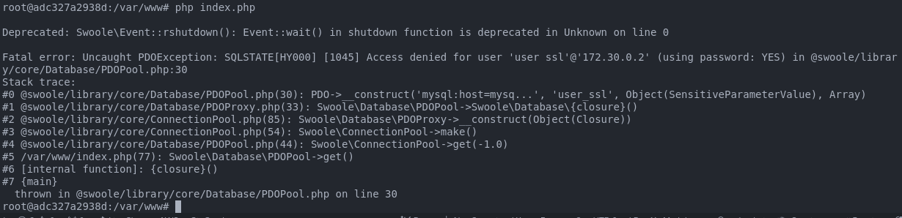
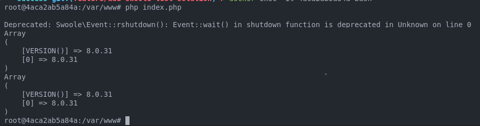

## How to reproduce bug
1. Run docker-compose
```sh
docker compose up -d --build
```
2. Enter container
```sh
docker exec -it $(docker ps -f name=hyperf-skeleton| grep "hyperf-skeleton" | awk '{ print $1 }') bash
```
3. Install dependencies
```sh
composer install
```
4. Run the command hyper of to see the bug
```sh
php bin/hyperf.php test
```
Error Expected:


5. Run the shell exec connection
```sh
php bin/shell-test.php
```
Expected connection successful


---
## Run Swoole tests correction
After opening the [issue](https://github.com/swoole/swoole-src/issues/5552) and closing it with the solution, the swoole-tests folder was created to test the fix made by the swoole team and it was found that problem been fixed.

1. Run error test
```sh
cd swoole-tests/error
docker compose up --build -d
docker exec -it $(docker ps -f name=swoole-error-app| grep "swoole-error-app" | awk '{ print $1 }') bash
php index.php
```
Error expected:



2. Run success test
```sh
cd swoole-tests/success
docker compose up --build -d
docker exec -it $(docker ps -f name=swoole-success-app| grep "swoole-success-app" | awk '{ print $1 }') bash
php index.php
```

Success expected:

