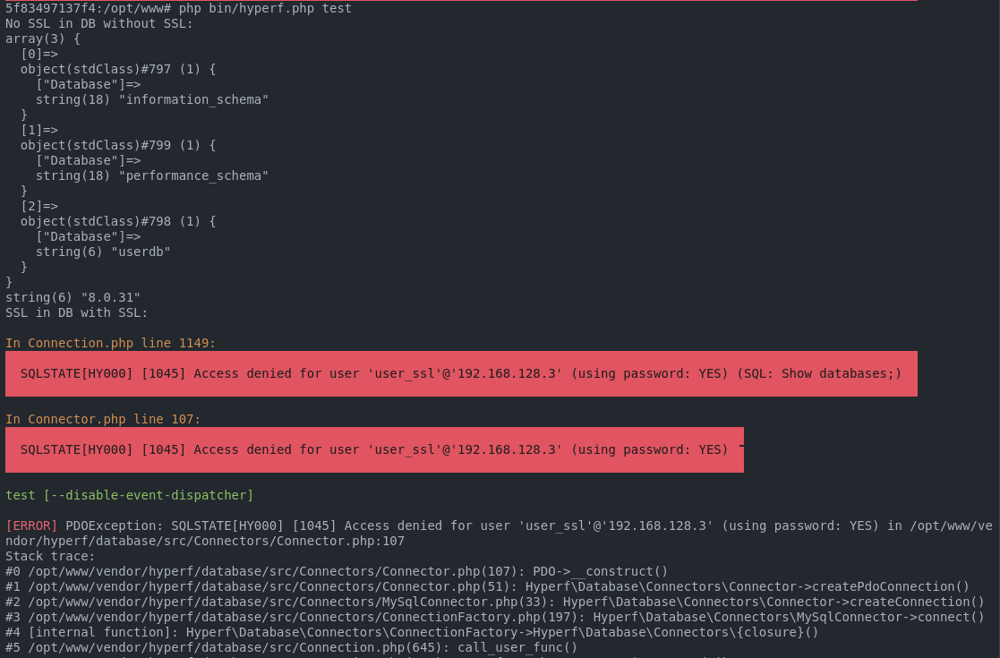
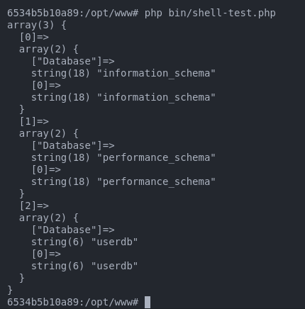

## How to reproduce bug
1. Run docker-compose
```sh
docker compose up -d --build
```
2. Enter container
```sh
docker exec -it $(docker ps -f name=hyperf-skeleton| grep "hyperf-skeleton" | awk '{ print $1 }') bash
```
3. Install dependencies
```sh
composer install
```
4. Run the command hyper of to see the bug
```sh
php bin/hyperf.php test
```
Error Expected:


5. Run the shell exec connection
```sh
php bin/shell-test.php
```
Expected connection successful


